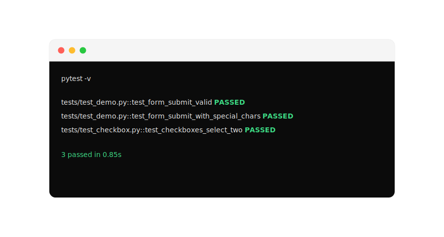

# Playwright QA Demo — pet-проект для автотестов

[](https://github.com/ttolmacheva-qa/playwright-qa-demo/actions)


> Коротко: учебный проект, где я отрабатываю базу QA Automation на реальных паттернах — Page Object, CI, HTML-отчеты. Тесты гоняются на каждый push, без внешних сайтов (все работает в GitHub Actions).

---

## Что внутри

- **3 стабильных автотеста:**
  - `test_form_submit_valid` — заполнение формы и проверка результата
  - `test_form_submit_with_special_chars` — проверка ввода спецсимволов
  - `test_checkboxes_select_two` — работа с чекбоксами
- **Page Object Model** — `pages/form_page.py`, `pages/checkbox_page.py`
- **Локальные тестовые страницы** в `/testsite` — не зависят от интернета
- **CI/CD на GitHub Actions** — установка браузеров, кэш, прогон за ~20 сек
- **HTML-отчет pytest-html** как артефакт



---

## Стек

- Python 3.11, pytest 8.4
- Playwright 1.48 (pytest-playwright)
- GitHub Actions, pytest-html
- Page Object Pattern

---

## Как запустить локально

```bash
git clone https://github.com/ttolmacheva-qa/playwright-qa-demo.git
cd playwright-qa-demo
python -m venv .venv && source .venv/bin/activate  # Windows: .venv\Scripts\activate
pip install -r requirements.txt
playwright install --with-deps chromium
pytest -v
```

HTML-отчет:
```bash
pytest -v --html=report.html --self-contained-html
open report.html
```

---

## CI и отчеты

Каждый push запускает workflow `.github/workflows/playwright.yml`:

1. Устанавливает зависимости и браузеры
2. Гоняет `pytest -v`
3. Сохраняет `report.html`

**Где скачать последний отчет:**
`Actions` → последний успешный прогон → раздел **Artifacts** → `playwright-report`

Прямая ссылка на прогоны: https://github.com/ttolmacheva-qa/playwright-qa-demo/actions

---

## Структура проекта

```
pages/               # Page Objects
tests/               # автотесты
  test_demo.py
  test_checkbox.py
testsite/            # локальные html-страницы
.github/workflows/   # CI
```

---

## Что дальше

- [ ] тест на dropdown / select
- [ ] скриншоты при падении
- [ ] публикация отчета на GitHub Pages

---
Сделано для портфолио QA Automation. Открыта к фидбэку и junior-позициям.
